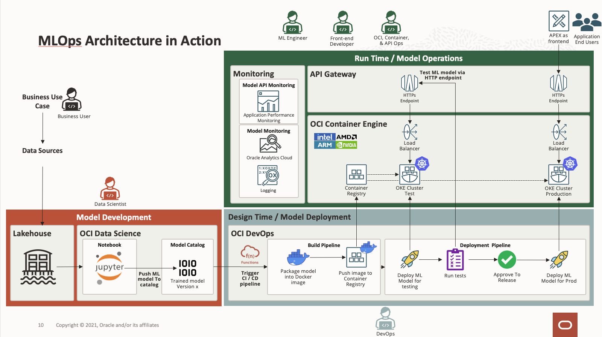

# **Terraform IaC Deployment for OCI MLOps**

## **Architecture Diagram**

## **Introduction**

This terraform stack deploys OCI resources needed to operationalize ML models using MLOps methodology for bank loan application use case. Data Scientists will be able to develop and train ML models using OCI Data Science and manage the ML models using Model Catalog. When a new model is committed to Model Catalog, OCI DevOps build pipeline will be triggered automatically to package the ML model into container then the model will be deployed and tested in the test OKE environement before publishing to production enviroment when it's approved by a release manager. The API GW will be interfacing with the model endpoint and served as public endpoint for external integration. APEX is used as the frontend for bank loan application and the **Smart Approval** feature makes use of the ML model to predict the eligibility of the loan.

## **Pre-requisites**
1. Users with `"manage"` permission for the resources listed in this [section](#deployed-resources).
2. Enough service limits and quota in the tenancy and compartment.
3. Create auth token. Refer to this [link](https://docs.oracle.com/en-us/iaas/Content/Identity/Tasks/managingcredentials.htm#create_swift_password)
4. Convert auth token to base64 using this [link](https://www.base64encode.org/)
5. **[Optional]** Obtain IDSC access token from IDSC Admin Portal for OAC deployment.

## **Deploy Using OCI Resource Manager**

Click the button to deploy to OCI.

## **Deployed Resources** 

These OCI resources will be deployed by this stack:
- Core Resources
    - VCN x3
    - Internet GW x3
    - Service GW x2
    - NAT GW x2
    - Route Table x5
    - Subnets x7
    - Security List x6
- Kubernetes
    - OKE cluster x2
    - OKE node pool x2
- ADB x1
- API
    - API GW x2
    - API Deployment x2
- APM
    - APM Domain x1
    - Synthetics Monitor x2
- Container Registry x3
- Data Science
    - Data Science Project x1
    - Data Science Notenbook Session x1
- DevOps
    - DevOps Project x1
    - Environment x3
    - Artifacts x4
    - Code Repository x1
    - Build Pipeline x1
    - Build Stages x2
    - Deployment Pipeline x1
    - Deployment Stages x5
- Events x1
- Functions
    - Application x2
    - Functions x2
- Oracle Analytic Cloud x1
- Object Storage
    - Bucket x1
    - Object x2
- KMS
    - Vault x1
    - Key x1
- Vault secret x1

## **Completing Demo Setup Tasks**

1. Import APEX bank loan application [here](apex_import/readme.md#apex-setup-procedures)

2. Import OAC Dashboard [here]()

3. Import Jupyter Notebook Project [here]()
